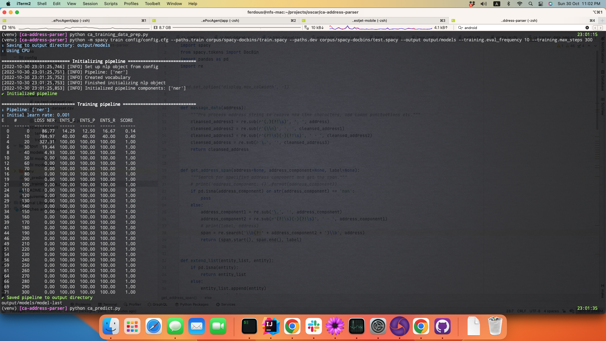

# ca-address-parser
This is a minimal implementation of a Canada address parser built using [spaCy NLP](https://spacy.io/usage/spacy-101) library. This [blog post](https://www.dynamicguy.com/admin/#/collections/post/entries/training-a-custom-spacy-model-to-recognise-canadian-addresses) covers the implementation and execution details at length.



## Prerequisites
- Python v3.x
- [spaCy v3.x](https://spacy.io/usage#installation)

## Folders
 - config
 - corpus
   - dataset
   - rules
   - spacy-docbins
 - output
   - models
     - model-best
     - model-last

## Training corpus
A sample corpus of US addresses to train/test the parser is present under [corpus/dataset](https://github.com/dynamicguy/ca-address-parser/tree/main/corpus/dataset) folder.
JSON based rules required by Entity ruler are present under [corpus/rules]()

## Config
[config](https://github.com/dynamicguy/ca-address-parser/tree/main/config) contains files for initializing training parameters:

**base_config.cfg**: Initializes pipeline and training batch size.
**base_config_er.cfg**: Similar as base_config but with additional entity ruler settings.
**config.cfg**: Pre filled config file obtained after executing inti fill-config.
**config_er.cfg**: Pre filled config file with additional entity ruler settings.

##  Output
[output](https://github.com/dynamicguy/ca-address-parser/tree/main/output) contains final trained models (with and without entity rules)

## Training prerequisites
Before starting the training process, we need to:

i) Obtain a pre-filled training config which has the required training parameters.

ii) Build spacy-docbin (binary serialized representation) files for training and test dataset.

**Pre-filled training config**:   Below command can be executed from command-line to get a pre filled config file. This would take as input the **base_config.cfg** file and churn out the pre-filled training config file: **config.cfg**.
>python -m spacy init fill-config config/base_config.cfg config/config.cfg

Similarly, to get entity-ruler based config, pointing this command to the **base_config_er.cfg** would churn out the pre filled config : **config_er.cfg**

**Prepare spacy-docbins**: Finally, a spacy-docbin file can be obtained by executing [ca_training_data_prep.py](https://github.com/dynamicguy/ca-address-parser/blob/main/ca_training_data_prep.py).
>python ca_training_data_prep.py

This would take raw csv [training/test datasets](https://github.com/dynamicguy/ca-address-parser/tree/main/corpus/dataset) as inputs and churn out docbin files under [corpus/spacy-docbins](https://github.com/dynamicguy/ca-address-parser/tree/main/corpus/spacy-docbins) folder.

## Training loop execution

To start the training process, below train command can be executed:
>**python -m spacy train config/config.cfg --paths.train corpus/spacy-docbins/train.spacy --paths.dev corpus/spacy-docbins/test.spacy --output output/models --training.eval_frequency 10 --training.max_steps 300**

This saves the output NER models under [output](https://github.com/dynamicguy/ca-address-parser/tree/main/output) folder.

## Predictions
Predictions for a few sample US addresses can be checked by executing [ca_predict.py](https://github.com/dynamicguy/ca-address-parser/blob/main/ca_predict.py)
>python ca_predict.py

## Output
```
Address string -> 16, 15 SILVER SPRINGS WY NW, AIRDRIE
Parsed address -> [('16', 'ADDR_UNIT'), ('15', 'ADDR_STREET_NUMBER'), ('SILVER SPRINGS', 'ADDR_STREET_NAME'), ('WY', 'ADDR_STREET_TYPE'), ('NW', 'ADDR_STREET_DIRECTION'), ('AIRDRIE', 'ADDR_CITY')]
******
Address string -> 46, 1008 WOODSIDE WY NW, AIRDRIE
Parsed address -> [('46', 'ADDR_UNIT'), ('1008', 'ADDR_STREET_NUMBER'), ('WOODSIDE', 'ADDR_STREET_NAME'), ('WY', 'ADDR_STREET_TYPE'), ('NW', 'ADDR_STREET_DIRECTION'), ('AIRDRIE', 'ADDR_CITY')]
******
Address string -> 9, 209 WOODSIDE DR NW, AIRDRIE
Parsed address -> [('9', 'ADDR_UNIT'), ('209', 'ADDR_STREET_NUMBER'), ('WOODSIDE', 'ADDR_STREET_NAME'), ('DR', 'ADDR_STREET_TYPE'), ('NW', 'ADDR_STREET_DIRECTION'), ('AIRDRIE', 'ADDR_CITY')]
******
Address string -> 42, 4 STONEGATE DR NW, AIRDRIE
Parsed address -> [('42', 'ADDR_UNIT'), ('4', 'ADDR_STREET_NUMBER'), ('STONEGATE', 'ADDR_STREET_NAME'), ('DR', 'ADDR_STREET_TYPE'), ('NW', 'ADDR_STREET_DIRECTION'), ('AIRDRIE', 'ADDR_CITY')]
******
Address string -> 7, 209 WOODSIDE DR NW, AIRDRIE
Parsed address -> [('7', 'ADDR_UNIT'), ('209', 'ADDR_STREET_NUMBER'), ('WOODSIDE', 'ADDR_STREET_NAME'), ('DR', 'ADDR_STREET_TYPE'), ('NW', 'ADDR_STREET_DIRECTION'), ('AIRDRIE', 'ADDR_CITY')]
******
Address string -> 306 190 KANANASKIS WAY, CANMORE
Parsed address -> [('306', 'ADDR_UNIT'), ('190', 'ADDR_UNIT'), ('KANANASKIS', 'ADDR_STREET_NAME'), ('WAY', 'ADDR_UNIT'), ('CANMORE', 'ADDR_STREET_NUMBER')]
```
